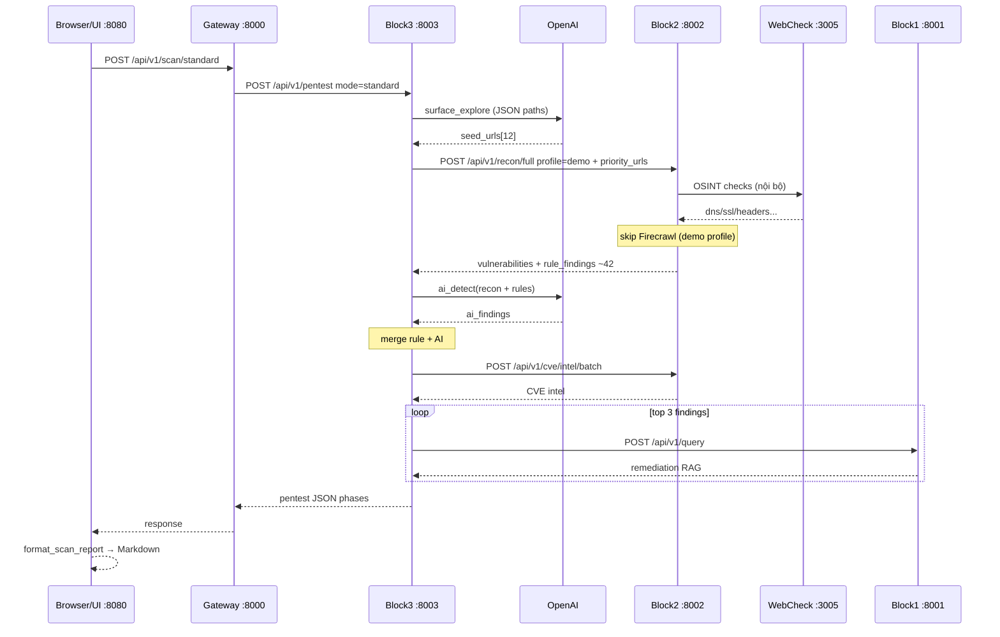
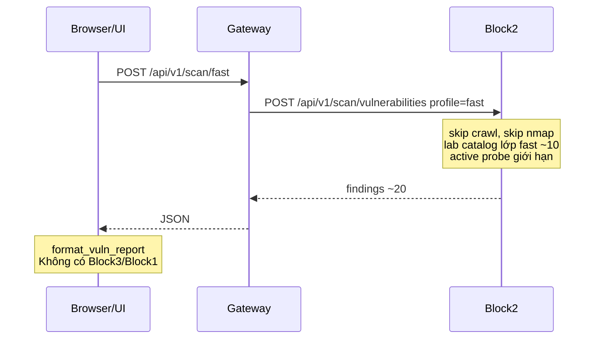

# Lu# Bài văn thuyết trình — Agentic SecOps

*Thời lượng khoảng 15–18 phút. Đọc tự nhiên, không cần đọc hết từng chữ — có thể rút gọn slide 18–19 nếu hết giờ.*

---

## Slide 1 — Trang bìa

Kính thưa Hội đồng,

Em tên là …, sinh viên lớp …, mã số sinh viên …

Hôm nay em xin trình bày đồ án tốt nghiệp với đề tài: **Agentic SecOps — Nền tảng kiểm thử xâm nhập tự động cho ứng dụng web, ứng dụng trí tuệ nhân tạo và RAG**.

Đề tài hướng tới một câu hỏi thực tế: làm sao tự động hóa phần lớn công việc lặp lại trong pentest web, đồng thời vẫn có khả năng giải thích lỗ hổng và gợi ý khắc phục có căn cứ — không chỉ dừng ở việc “báo có lỗi”.

Em xin phép được trình bày.

---

## Slide 2 — Nội dung trình bày

Bài trình bày gồm tám phần chính.

Thứ nhất, em đặt vấn đề và nêu tính cấp thiết của đề tài.

Thứ hai, mục tiêu và phạm vi nghiên cứu.

Thứ ba, khảo sát hiện trạng và các công nghệ liên quan.

Thứ tư — và cũng là phần em dành nhiều thời gian nhất — kiến trúc và thiết kế hệ thống năm khối microservices.

Thứ năm, các cơ chế kỹ thuật nổi bật: điều phối AI, song song hóa, chống cảnh báo sai.

Thứ sáu, demo và kết quả thực nghiệm trên môi trường lab hợp pháp.

Thứ bảy, đánh giá ưu nhược điểm.

Cuối cùng, hướng phát triển và kết luận.

---

## Slide 3 — Đặt vấn đề

Trong bối cảnh số hóa, số lượng ứng dụng web tăng rất nhanh, bề mặt tấn công theo OWASP Top 10 — XSS, SQL Injection, lộ thông tin, cấu hình sai — ngày càng lớn.

Pentest truyền thống do chuyên gia thực hiện thủ công có ưu điểm là sâu và linh hoạt, nhưng tốn thời gian, khó lặp lại đồng nhất, khó mở rộng khi số lượng hệ thống cần kiểm tra tăng lên.

Ngược lại, các công cụ quét tự động quen thuộc như scanner, Nikto hay Nmap mạnh về dò quét, nhưng thường sinh nhiều cảnh báo nhiễu, thiếu khả năng diễn giải theo ngữ cảnh cụ thể của từng ứng dụng, và hầu như không gợi ý khắc phục dựa trên tri thức CVE một cách có kiểm soát.

Thêm vào đó, CVE mới xuất hiện liên tục; việc cập nhật tri thức kịp thời cho đội vận hành là thách thức.

Khoảng trống em nhắm tới là: **cần một nền tảng vừa tự động hóa recon và phát hiện lỗ hổng, vừa tận dụng AI để phân tích và RAG để gợi ý khắc phục có nguồn — thay vì chỉ trả về danh sách cảnh báo thô.**

---

## Slide 4 — Mục tiêu và phạm vi

Mục tiêu tổng quát của đề tài là xây dựng nền tảng mà người dùng chỉ cần nhập URL hợp pháp, hệ thống sẽ tự động recon, phát hiện lỗ hổng bằng luật và AI, gợi ý khắc phục, rồi xuất báo cáo qua giao diện Chat hoặc API.

Về mặt kỹ thuật, em hướng tới ba điểm: kết hợp rule-based scanner với LLM để bổ sung phân tích ngữ cảnh; xây dựng kho tri thức CVE cục bộ bằng RAG với Ollama và Chroma; và triển khai kiến trúc microservices để dễ mở rộng, có thể chạy Docker hoặc script trên Windows.

Phạm vi đề tài **chỉ áp dụng cho mục tiêu được phép kiểm thử**, ví dụ các lab công khai như testphp.vulnweb.com hay demo.testfire.net. Hệ thống tập trung lỗ hổng web phổ biến; **không** thực hiện khai thác sâu chiếm quyền điều khiển hay tấn công từ chối dịch vụ.

Về đạo đức, em thiết kế ràng buộc ngay trong prompt AI: chỉ phục vụ pentest được ủy quyền, không gửi payload phá hoại, không quét tràn lan ngoài phạm vi.

---

## Slide 5 — Khảo sát hiện trạng

Qua khảo sát, em thấy các nhóm công cụ sau bổ trợ cho nhau nhưng hiếm khi được tích hợp thành một pipeline thống nhất.

Scanner truyền thống và Acunetix, OWASP ZAP mạnh về quy tắc và báo cáo chuẩn hóa, nhưng yếu về diễn giải linh hoạt.

Công cụ OSINT như Web-Check giúp thu thập DNS, SSL, header, whois.

Crawler hiện đại như Firecrawl kết hợp Playwright giúp thu thập trang có JavaScript.

Về AI, LLM từ OpenAI, Groq hay Gemini có thể phân tích dữ liệu recon; kết hợp RAG cho phép truy hồi tài liệu CVE cục bộ thay vì “đoán” từ trí nhớ mô hình.

Khoảng trống em chọn lấp là: **một hệ thống agentic** — có bộ điều phối gọi lần lượt các công cụ, gộp kết quả, làm giàu tri thức và trả báo cáo — thay vì người dùng phải tự chạy từng công cụ rời rạc.

---

## Slide 6 — Hướng tiếp cận Agentic SecOps

Em đặt tên hướng tiếp cận là **Agentic SecOps** với bốn trụ cột.

Thứ nhất, **điều phối agentic**: một orchestrator đóng vai trò “điều phối viên”, quyết định gọi recon, gọi AI phân tích, gọi knowledge base — không phải một script tuyến tính cố định.

Thứ hai, **phát hiện lai**: luật cho độ chính xác cao trên các mẫu đã biết; AI bổ sung phân tích trên dữ liệu recon phức tạp; sau đó gộp và khử trùng lặp.

Thứ ba, **RAG tri thức CVE**: câu trả lời khắc phục dựa trên chunk CVE đã index, giảm ảo giác.

Thứ tư, **nhiều lớp xác minh**: heuristic, active probe gửi payload thật, catalog YAML verify, và ràng buộc evidence cho AI.

Điểm quan trọng em muốn nhấn: hệ thống **không thay thế pentester**, mà tự động hóa các bước lặp lại và hỗ trợ ra quyết định nhanh hơn.

---

## Slide 7 — Kiến trúc năm khối

Kiến trúc tổng thể gồm năm khối giao tiếp qua REST API.

Người dùng tương tác qua **Block 5 — Chat UI** trên cổng 8080, hoặc qua CLI.

Mọi yêu cầu đi qua **Block 4 — Gateway** cổng 8000, đóng vai trò proxy thống nhất, gộp health check và cấu hình timeout theo từng loại tác vụ.

Gateway phân luồng xuống ba dịch vụ chính:

**Block 2 — Recon** cổng 8002: Firecrawl, Nmap, Web-Check, engine quét lỗ hổng rule-based, active probe.

**Block 3 — Agents** cổng 8003: orchestrator AI — surface discovery, detect, probe, làm giàu báo cáo.

**Block 1 — Knowledge** thường triển khai trên máy ảo Ubuntu vì cần Ollama và Chroma: khoảng 448 nghìn chunk CVE, phục vụ truy vấn RAG.

Ngoài ra Web-Check chạy Node trên cổng 3005, nằm trong phạm vi Block 2.

Thiết kế microservices giúp em thay từng khối độc lập — ví dụ đổi LLM cloud ở Block 3 mà không đụng Block 1.

---

## Slide 8 — Công nghệ sử dụng

Toàn bộ backend em viết bằng **Python 3.11**, framework **FastAPI**, server **Uvicorn**, giao tiếp bất đồng bộ **asyncio** và **aiohttp**.

Về AI, Block 3 dùng **OpenAI** làm provider chính cho surface discovery, phát hiện lỗ hổng và probe; hệ thống có sẵn cơ chế fallback sang Groq hoặc Gemini khi cần.

Block 1 dùng **Ollama** với mô hình embed và chat, kết hợp **Chroma** làm vector database.

Recon dùng **Firecrawl API**, **Nmap**, và **Web-Check**.

Giao diện là HTML/JavaScript tĩnh, render Markdown bằng thư viện marked, lưu lịch sử phiên bằng **SQLite**.

Triển khai có **Docker Compose** cho đủ năm container, hoặc script **start.bat** trên Windows để khởi động toàn bộ stack một lệnh.

---

## Slide 9 — Block 1: Knowledge RAG

Block 1 có nhiệm vụ duy nhất là **tri thức** — không điều phối pentest.

Pipeline RAG hoạt động như sau: tài liệu CVE dạng markdown được chunk, embed bằng Ollama, lưu vào Chroma với không gian cosine.

Khi truy vấn, hệ thống trích CVE-ID trong câu hỏi nếu có, lọc và tìm top-k chunk liên quan. Nếu truy hồi vector không đủ tốt nhưng đã biết CVE-ID, em có lớp fallback đọc trực tiếp file nguồn.

Câu trả lời cuối do Ollama sinh ra với ràng buộc: **chỉ dùng ngữ cảnh CVE đã cung cấp**, kèm nguồn trích dẫn.

Indexing hỗ trợ checkpoint và resume, xử lý được hàng trăm nghìn CVE từ NVD JSON feeds — phù hợp môi trường thực nghiệm dài hạn.

Trong luồng pentest, Block 3 gọi Block 1 qua REST khi cần làm giàu khắc phục cho các finding mức độ nghiêm trọng cao nhất.

---

## Slide 10 — Block 2: Recon và quét lỗ hổng

Block 2 là “tay và mắt” của hệ thống.

Endpoint tổng hợp **recon/full** chạy OSINT, Nmap và Firecrawl **song song**. Firecrawl có thể chậm, nên em dùng cơ chế grace timeout: chờ tối đa N giây, quá hạn thì hủy task crawl và tiếp tục với dữ liệu đã có — tránh treo cả pipeline.

Engine **vuln_scanner** kiểm tra passive: thiếu security header, directory listing, lộ thông tin nhạy cảm, form không an toàn, port nguy hiểm, v.v.

Quan trọng hơn, **active probe** gửi payload thật: chuỗi XSS đặc trưng và dấu nháy đơn cho SQLi; chỉ báo xác nhận khi phản hồi khớp mẫu — ví dụ payload XSS chưa bị encode, hoặc thông báo lỗi SQL trong body.

Với lab vulnweb đã biết, em còn có **lab catalog** căn chỉnh theo báo cáo Acunetix để đảm bảo độ bao phủ khi demo.

Chế độ **Fast** trên Block 2 bỏ qua crawl, chỉ chạy rule và catalog lớp nhanh — phù hợp quét sơ bộ trong một đến hai phút.

---

## Slide 11 — Block 3: Điều phối AI

Block 3 là “bộ não điều phối”.

**Orchestrator** triển khai hai luồng pentest chính — Standard và Deep — cùng với việc UI gọi Fast trực tiếp xuống Block 2.

Trước recon, **Surface Explorer** dùng OpenAI đề xuất danh sách URL và path ưu tiên — ví dụ trang login, search có tham số, guestbook — gửi sang Block 2 dưới dạng priority_urls. Đây là cách em **bổ sung** cho Firecrawl khi crawl không đủ trang, chứ không thay thế hoàn toàn.

Sau recon, **AI Detector** đọc dữ liệu recon đã cắt gọn — giới hạn khoảng mười hai đến mười sáu nghìn ký tự — rồi xuất JSON findings. Prompt yêu cầu chỉ báo khi có evidence, không bịa CVE hay URL.

Kết quả rule và AI được **gộp** theo khóa type–location–mô tả; ưu tiên giữ finding từ rule khi trùng.

Deep mode có thêm vòng **probe loop**: AI gợi ý test bổ sung, Block 2 chạy targeted probe, rồi detect lại.

Cuối cùng hệ thống tính **điểm rủi ro** từ phân bố mức độ nghiêm trọng và đưa khuyến nghị tổng thể.

---

## Slide 12 — Gateway và giao diện

**Gateway** giúp client — UI hay script — chỉ cần nhớ một địa chỉ.

Em thiết kế **ba endpoint scan tách biệt**, tương ứng ba chế độ:

- **POST /api/v1/scan/fast** — chỉ Block 2, rule-based.
- **POST /api/v1/scan/standard** — Block 3 pentest chuẩn.
- **POST /api/v1/scan/deep** — Block 3 pentest sâu.

Timeout được cấu hình riêng: fast ngắn, standard và deep dài hơn vì có AI và RAG.

**Chat UI** cho phép chọn ba pill Nhanh / Chuẩn / Sâu, hiển thị báo cáo Markdown và panel chi tiết findings, CVE manifest, nguồn KB. Lịch sử phiên lưu SQLite để so sánh nhiều lần quét.

Người dùng khởi động toàn bộ bằng một lệnh **start.bat**, hệ thống tự health check và mở trình duyệt.

---

## Slide 13 — Luồng pentest end-to-end

Em xin mô tả luồng **Standard** — đại diện cho pentest có AI:

Bước một, UI gửi URL tới Gateway endpoint standard.

Bước hai, Block 3 chạy **surface explore**: OpenAI sinh khoảng mười hai seed URL.

Bước ba, Block 2 **recon/full** với profile phù hợp: OSINT, Nmap, crawl có grace, fetch seed, phân tích vuln, catalog lab nếu là vulnweb.

Bước bốn, nếu crawl yếu, surface **refine** có thể đề xuất thêm path và chạy targeted probe.

Bước năm, **AI detect** trên dữ liệu recon, merge với rule findings.

Bước sáu, **CVE manifest** — thu thập CVE liên quan, tra cứu NVD local.

Bước bảy, **knowledge enrichment** — song song vài finding quan trọng nhất qua RAG Block 1.

Kết quả trả về JSON có từng phase và timing; UI chuyển thành báo cáo Markdown.

Luồng **Fast** ngắn hơn nhiều: Gateway gọi thẳng Block 2, không qua Block 3, không AI, không KB — phù hợp khảo sát nhanh.

Luồng **Deep** thêm crawl đầy đủ hơn, probe loop, làm giàu KB nhiều finding hơn.

---

## Slide 14 — LLM đa nhà cung cấp và fallback

Module **LLM client** hỗ trợ nhiều provider và tự nhận diện API key hợp lệ, bỏ qua key placeholder.

Có thể gán provider riêng cho từng tác vụ: surface, plan, detect, probe, remediate.

**Fallback** chỉ kích hoạt khi lỗi tạm thời — rate limit, timeout, dịch vụ không sẵn sàng — không fallback khi lỗi logic như JSON sai schema, để tránh lãng phí token.

Metadata trả về ghi rõ provider thực dùng và có fallback hay không — tiện cho debug và demo.

Trong cấu hình hiện tại của em, Block 3 dùng OpenAI cho tác vụ điều phối; Block 1 giữ Ollama cho RAG — **tách vai trò rõ ràng**, tối ưu chi phí và độ ổn định.

---

## Slide 15 — Song song hóa và grace timeout

Một bài toán thực tế em gặp là Firecrawl đôi khi chậm hoặc treo.

Giải pháp: chạy task crawl nền; đồng thời chạy OSINT và Nmap; chờ crawl tối đa **grace seconds** — trong chế độ demo khoảng 40 giây. Hết giờ thì hủy, đánh dấu `grace_exceeded`, tiếp tục với partial data.

Triết lý thiết kế: **không bước nào được phép kéo chết cả hệ thống**.

Tương tự, active probe có budget thời gian; làm giàu KB có budget và số lượng finding top-N; gọi LLM có timeout riêng.

Toàn bộ dùng asyncio và gather/semaphore để tận dụng thời gian chờ I/O — wall-clock ngắn hơn nhiều so với chạy tuần tự.

Khi crawl thiếu, AI vẫn nhận được metadata grace exceeded để điều chỉnh mức tự tin phân tích.

---

## Slide 16 — Chống cảnh báo sai

Đây là điểm em muốn phân biệt với scanner thông thường.

**Lớp một — heuristic**: bỏ qua trang tài liệu, tutorial khi dò “lộ thông tin”.

**Lớp hai — active probe**: XSS chỉ confirmed khi payload phản chiếu chưa encode; SQLi khi khớp regex lỗi cơ sở dữ liệu.

**Lớp ba — verify catalog YAML**: mỗi loại finding có thể được kiểm tra lại bằng HTTP header, regex body — **không tốn LLM**.

**Lớp bốn — ràng buộc AI**: prompt cấm bịa CVE và URL; chỉ báo khi trích được evidence từ recon.

Kết quả verify gắn nhãn như confirmed, not reproduced, no catalog entry — giúp người đọc báo cáo biết mức độ tin cậy.

Nhờ đó, chế độ Fast tuy ít finding hơn — khoảng 20 trên vulnweb — nhưng là tập rule và catalog lớp nhanh; Standard và Deep lên khoảng 42 đến 49 finding khi có đủ recon, AI merge và catalog đầy đủ — **ba chế độ cho ba mục đích khác nhau**, không trùng lặp.

---

## Slide 17 — Demo và kết quả thực nghiệm

Em xin trình bày kết quả trên **http://testphp.vulnweb.com** — lab Acunetix công khai.

Với chế độ **Nhanh**, thời gian khoảng một đến hai phút, phát hiện khoảng **20** finding: SQLi, XSS phản chiếu, LFI, thiếu header, v.v. Báo cáo tiêu đề “Quick scan — rule-based”, không có phần AI analysis hay CVE manifest đầy đủ.

Với chế độ **Chuẩn**, khoảng **ba phút**, khoảng **42** finding: thêm lớp OpenAI surface seeds, AI detect merge, làm giàu KB top 3 finding nghiêm trọng.

Với chế độ **Sâu**, khoảng **bốn đến sáu phút** tùy cấu hình, khoảng **48–49** finding, có probe loop, CVE manifest và enrich nhiều hơn.

Báo cáo Markdown gồm bảng tổng hợp, điểm rủi ro, chi tiết từng finding kèm CWE/CVE khi có, và gợi ý khắc phục từ RAG.

*(Nếu demo trực tiếp: mở UI, chọn Nhanh quét trước, sau đó Chuẩn — Hội đồng thấy rõ thời gian và số finding khác nhau. Chuẩn bị sẵn ảnh chụp phòng khi mạng chậm.)*

---

## Slide 18 — Ưu điểm và hạn chế

**Ưu điểm:**

- Tự động hóa gần như toàn trình từ URL đến báo cáo có diễn giải.
- Kiến trúc hybrid rule + AI + RAG, nhiều lớp xác minh.
- Microservices tách biệt, ba API scan rõ ràng, dễ mở rộng.
- Cơ chế grace, fallback, demo mode — phù hợp triển khai thực tế.

**Hạn chế:**

- Phụ thuộc chất lượng và độ trễ Firecrawl cloud, OpenAI API.
- Index kho CVE lớn tốn thời gian và tài nguyên máy ảo.
- Phạm vi lỗ hổng tập trung web phổ biến; chưa IDOR, SSRF sâu, chưa exploit post-auth phức tạp.
- Xác thực người dùng còn đơn giản — local user, chưa OAuth đa tổ chức.

Em trình bày hạn chế một cách trung thực vì đó là hướng em đã định lượng được khi triển khai.

---

## Slide 19 — Hướng phát triển

Trong tương lai, em đề xuất:

Mở rộng lớp lỗ hổng: IDOR, SSRF, auth bypass, API và GraphQL.

Bổ sung xác thực OAuth, quản lý đội và lịch quét định kỳ.

Tích hợp CI/CD — DevSecOps: quét tự động khi deploy.

Đánh giá định lượng precision/recall trên bộ OWASP Benchmark.

Fine-tune mô hình chuyên ngành bảo mật; mở rộng kho tri thức exploit và CWE.

Em ưu tiên ba hướng khả thi nhất: mở rộng API security, tích hợp pipeline CI, và benchmark định lượng.

---

## Slide 20 — Kết luận

Tóm lại, em đã xây dựng thành công **Agentic SecOps** — nền tảng pentest tự động năm khối, kết hợp công cụ recon truyền thống, điều phối AI và RAG tri thức CVE cục bộ.

Đề tài đạt mục tiêu: phát hiện lỗ hổng web phổ biến trên môi trường lab, xác minh nhiều lớp, gợi ý khắc phục có dẫn nguồn, trình bày báo cáo trực quan qua Chat UI.

Đóng góp chính là kiến trúc **agentic có khả năng diễn giải**, phân tầng ba chế độ quét với ba API riêng, và các cơ chế bền vững — timeout, fallback, chống false positive.

Em xin chân thành cảm ơn Thầy/Cô hướng dẫn và Hội đồng đã lắng nghe.

Em sẵn sàng trả lời câu hỏi.

---

## Gợi ý khi bị hỏi (nói ngắn, không cần lên slide)

**Khác gì OWASP ZAP?**  
ZAP là scanner. Em xây pipeline agentic: recon song song, OpenAI bổ sung surface, RAG khắc phục, ba mức quét — ZAP không có lớp điều phối và RAG tích hợp sẵn như vậy.

**AI có bịa không?**  
Prompt cấm bịa; merge ưu tiên rule; active probe và verify YAML xác nhận độc lập. AI chỉ phân tích dữ liệu công cụ đã thu — không thay thế probe.

**Vì sao Block 1 trên VM?**  
Ollama embed hàng trăm nghìn chunk CVE — cần RAM ổn định. Block 3 gọi REST, nhẹ, chạy local.

**Fast có phải Deep rút gọn?**  
Không. Fast không qua Block 3, không AI, không KB — API và backend khác hẳn. Số finding và thời gian chứng minh điều đó.

---

*Bạn có thể in bài này làm giấy nhắc; khi thuyết trình chỉ cần nhìn slide và nói theo ý — không cần đọc word-for-word.*ồng hoạt động 3 chế độ scan — từ UI đến từng API

Dưới đây là bản giải thích **theo đúng code hiện tại**, kèm **vị trí gọi API** (HTTP giữa các khối) và **xử lý nội bộ** (không qua Gateway).

---

## Tổng quan: 3 đường đi khác nhau

```
                    ┌─────────────────────────────────────────┐
                    │  Block 5 UI (:8080)                     │
                    │  POST /api/chat/scan  { url, mode }     │
                    └──────────────────┬──────────────────────┘
                                       │
                    ┌──────────────────▼──────────────────────┐
                    │  Block 4 Gateway (:8000)                │
                    │  Chọn 1 trong 3 endpoint:               │
                    └──────┬──────────────┬──────────────┬──────┘
                           │              │              │
              FAST         │   STANDARD   │    DEEP      │
                           ▼              ▼              ▼
                    /scan/fast    /scan/standard  /scan/deep
                           │              │              │
                           ▼              └──────┬───────┘
                    Block 2 (:8002)              ▼
                    CHỈ 1 API            Block 3 (:8003)
                                       POST /api/v1/pentest
                                              │
                         ┌────────────────────┼────────────────────┐
                         ▼                    ▼                    ▼
                   Block 2 (:8002)      OpenAI (cloud)      Block 1 (:8001 VM)
                   nhiều API            LLM nội bộ         RAG / CVE push
```

**Điểm then chốt:**

| Mode | Gateway endpoint | Block 3? | Block 1? | OpenAI? |
|------|------------------|----------|----------|---------|
| **Nhanh** | `POST /api/v1/scan/fast` | Không | Không | Không |
| **Chuẩn** | `POST /api/v1/scan/standard` | Có | Có (KB enrich) | Có |
| **Sâu** | `POST /api/v1/scan/deep` | Có | Có | Có (+ probe loop) |

---

## Lớp 1 — Trình duyệt → UI → Gateway

### Bước 1: Người dùng bấm Quét

File: `block5-ui/static/app.js`

```303:306:d:\code\agentic-secops\block5-ui\static\app.js
async function runScan(url, mode, sessionId) {
  const body = { url, mode, session_id: sessionId };
  if (mode === "fast") body.scan_profile = "fast";
  return api("/api/chat/scan", { method: "POST", body: JSON.stringify(body) });
```

→ Gọi **nội bộ UI**, không gọi Gateway trực tiếp từ browser (UI làm proxy).

### Bước 2: UI chọn Gateway endpoint theo mode

File: `block5-ui/app/main.py`

| Mode UI | Gọi Gateway | Timeout |
|---------|-------------|---------|
| `fast` | `POST http://127.0.0.1:8000/api/v1/scan/fast` | 180s |
| `standard` | `POST .../api/v1/scan/standard` | 600s |
| `deep` | `POST .../api/v1/scan/deep` | 1800s |

Body fast gửi thêm `scan_profile: "fast"`. Standard/Deep chỉ gửi `{ "url": "..." }`.

### Bước 3: Gateway phân luồng

File: `block4-gateway/app/main.py`

```143:166:d:\code\agentic-secops\block4-gateway\app\main.py
@app.post("/api/v1/scan/fast")
async def scan_fast(...):
    return await services.recon.post("/api/v1/scan/vulnerabilities", payload)

@app.post("/api/v1/scan/standard")
async def scan_standard(...):
    return await _pentest_via_agents(str(body.url), "standard")

@app.post("/api/v1/scan/deep")
async def scan_deep(...):
    return await _pentest_via_agents(str(body.url), "deep")
```

Từ đây **nhánh Fast tách hẳn**; Standard và Deep cùng đi Block 3 nhưng `mode` khác nhau.

---

## Luồng 1 — SCAN NHANH (Fast)

### Mục đích
Quét rule-based thuần Block 2: **không AI, không KB, không orchestrator**.

### Chuỗi HTTP (chỉ 3 hop)

```
[1] Browser → Block5   POST /api/chat/scan          { mode: "fast", url, scan_profile: "fast" }
[2] Block5  → Gateway  POST /api/v1/scan/fast       { url, scan_profile: "fast" }
[3] Gateway → Block2   POST /api/v1/scan/vulnerabilities  { url, scan_profile: "fast" }
```

**Không có** hop nào tới `:8003` (Block 3) hay `:8001` (Block 1).

### Trong Block 2 — `vuln_scanner.scan()`

File: `block2-recon/app/vuln_scanner.py` + `scan_profiles.py`

Profile **`fast`**:

```10:29:d:\code\agentic-secops\block2-recon\app\scan_profiles.py
def _profile_fast() -> Dict[str, Any]:
    return {
        ...
        "skip_crawl": True,      # Bỏ Firecrawl
        "skip_nmap": True,       # Bỏ Nmap
        "max_seeds": 8,
        "max_probes": ≤12,
        "skip_extra_seeds": True,
    }
```

**Thực tế chạy gì:**

1. **Không** gọi Firecrawl cloud  
2. **Không** gọi Nmap  
3. Chạy **passive analysis** trên dữ liệu tối thiểu (0 trang crawl)  
4. **Lab catalog** (`lab_findings.py`) — chỉ lớp **fast** (~10 loại), **không** pad lên 30+  
5. Có thể chạy **active probe** giới hạn trên seed URL lab  
6. **Verify catalog** YAML (nội bộ Block 2)  
7. Trả JSON: `{ findings, summary, verify_catalog, ... }`

### Kết quả về UI

- UI dùng `format_vuln_report()` → tiêu đề **"Quick scan (rule-based)"**  
- Không có `phases`, không `ai_detection`, không `cve_manifest`  
- Vulnweb: **~20 findings**, **~1–2 phút**

---

## Luồng 2 — SCAN CHUẨN (Standard)

### Mục đích
Pentest có AI: OpenAI tìm URL → recon → detect → merge → CVE manifest → làm giàu KB.

### Chuỗi HTTP cấp cao

```
[1] Browser → Block5   POST /api/chat/scan           { mode: "standard", url }
[2] Block5  → Gateway  POST /api/v1/scan/standard  { url }
[3] Gateway → Block3   POST /api/v1/pentest         { url, mode: "standard" }
       │
       └── Block3 orchestrator gọi tiếp nhiều API (xem bảng dưới)
[4] Block3  → Block5   (response JSON pentest đầy đủ phases)
[5] Block5  → Browser  Markdown + run JSON
```

Entry Block 3:

```105:114:d:\code\agentic-secops\block3-agents\app\main.py
@app.post("/api/v1/pentest")
async def run_pentest(body: PentestRequest):
    result = await orchestrator.execute_pentest(str(body.url), mode=body.mode)
```

→ `mode=standard` → `_execute_standard()` trong `orchestrator.py`.

### Các phase Standard — API & xử lý nội bộ

Với `PENTEST_DEMO_MODE=true` (cấu hình demo hiện tại):

| # | Phase | Gọi API HTTP? | Chi tiết |
|---|--------|---------------|----------|
| 0 | `ai_planning` | Không | **Skipped** — standard không lập kế hoạch |
| 1 | `ai_surface_explore` | **OpenAI trực tiếp** (không qua Gateway) | `surface_explorer.explore()` → sinh ~12 `seed_urls` |
| 2 | `recon_full` | **Block2** `POST /api/v1/recon/full` | Profile **`demo`**: skip crawl, skip nmap, có OSINT + seeds |
| 2b | (trong recon/full) | **WebCheck** `:3005` nội bộ Block2 | OSINT 35 checks |
| 2c | | **Firecrawl** | **Bỏ qua** (skip_crawl) |
| 3 | `ai_surface_refine` | OpenAI (nếu crawl yếu) | Thường skip vì demo không crawl |
| 3b | `ai_surface_probe` | **Block2** `POST /api/v1/scan/targeted` | Chỉ khi refine có seed mới |
| 4 | `rag_assist` | **Skipped** (demo mode) | Bình thường: Block1 `POST /api/v1/query` |
| 5 | `ai_detect` | **OpenAI trực tiếp** | `detector.detect()` — merge với rule findings |
| 6 | `cve_manifest` | **Block2** `POST /api/v1/cve/intel/batch` | Tra NVD local + intel |
| 7 | `cve_ingest` | **Skipped** (demo) | Bình thường: Block2 intel → Block1 `POST /api/v1/cve/push` |
| 8 | `knowledge_enrichment` | **Block1** `POST /api/v1/query` × **3** (top 3 findings) | RAG khắc phục song song |
| 9 | `summary` | Không | Tính risk score, trả `findings_merged` |

### API Block 3 → Block 2 (Standard)

File: `block3-agents/app/clients/recon_client.py`

```65:92:d:\code\agentic-secops\block3-agents\app\clients\recon_client.py
async def full_recon(...):
    body = {
        "url": url,
        "firecrawl_grace_seconds": 40,   # DEMO_FIRECRAWL_GRACE_SECONDS
        "scan_profile": "demo",          # DEMO_RECON_PROFILE_STANDARD
        "priority_urls": [...],          # từ OpenAI surface
    }
    return await self._post("/api/v1/recon/full", body)
```

Trong Block 2 `recon/full`:

```381:390:d:\code\agentic-secops\block2-recon\app\main.py
    osint, tools, fc_grace = await gather_recon_tools(
        ...
        skip_crawl=bool(prof.get("skip_crawl")),  # True với profile demo
    )
    ...
    vuln = await scanner.analyze_from_tools(url, tools, scan_profile="demo")
```

→ OSINT chạy, crawl **bỏ**, vuln + **lab catalog pad tới 30+** → ~42 rule findings trước AI merge.

### API Block 3 → Block 1 (Standard)

File: `block3-agents/app/clients/knowledge_client.py`

- `POST http://34.126.70.137:8001/api/v1/query` — enrich từng finding (parallel, top 3)
- Không gọi Block 1 nếu `ENABLE_KB=false` hoặc KB unreachable

### Kết quả Standard

- Response có `phases.*`, `findings_merged`, `timing`  
- UI: `format_scan_report()` — **"Pentest report (standard)"**  
- Vulnweb demo: **~42 findings**, **~3 phút**

---

## Luồng 3 — SCAN SÂU (Deep)

### Mục đích
Giống Standard nhưng recon **đầy đủ hơn** (có Firecrawl grace), **probe loop**, enrich KB nhiều hơn.

### Chuỗi HTTP cấp cao

```
[1] Browser → Block5   POST /api/chat/scan        { mode: "deep", url }
[2] Block5  → Gateway  POST /api/v1/scan/deep     { url }
[3] Gateway → Block3   POST /api/v1/pentest        { url, mode: "deep" }
       └── orchestrator._execute_deep()
[4] Response pentest → UI → Markdown
```

### Khác Standard ở đâu?

| Hạng mục | Standard (demo) | Deep (demo) |
|----------|-----------------|-------------|
| Recon profile | `demo` (skip crawl) | `standard` (có Firecrawl grace ~40s) |
| `ai_planning` | Skip | Skip (`PENTEST_SKIP_PLAN=true`) |
| `ai_surface_explore` | Có | Có |
| `recon_full` | OSINT + seeds, không crawl | OSINT + **Nmap** + **Firecrawl grace** + vuln đầy đủ |
| `ai_probe_loop` | **Không** | **Có** — 1 vòng (demo) |
| `cve_ingest` | Skip (demo) | Skip (demo) |
| KB enrich | Top **3** | Top **6** |
| Findings vulnweb | ~42 | ~48–49 |
| Thời gian | ~3 phút | ~4–6 phút |

### Các phase Deep bổ sung

**Sau `ai_detect` — probe loop:**

```
Block3 probe_executor
    → Block2 POST /api/v1/scan/targeted  { url, probes: [...] }
    → (nếu có findings mới) gọi ai_detect lại
```

Config: `AI_PROBE_MAX_ROUNDS=1` trong demo mode.

**Recon profile deep (khi không demo):**

```65:76:d:\code\agentic-secops\block2-recon\app\scan_profiles.py
def _profile_deep() -> Dict[str, Any]:
    return {
        "max_pages": 100,
        "max_probes": 120,
        "skip_crawl": False,
        ...
    }
```

Trong demo: `DEMO_RECON_PROFILE_DEEP=standard` — deep dùng profile `standard`, không phải `deep` full.

### Trong `recon/full` (Deep) — gọi nội bộ Block 2

```
gather_recon_tools()
  ├─ Task nền: Firecrawl API (cloud)     ← grace timeout 40s
  ├─ Song song: WebCheck :3005 (OSINT)
  ├─ Song song: Nmap (local)
  └─ discover_surface_urls()

url_discovery_fetch()     ← fetch thêm URL từ sitemap/seeds
fetch_priority_seed_pages() ← URL từ OpenAI priority_urls
analyze_from_tools()      ← passive + active probe + lab catalog + verify
analyze_cve_surface()     ← CVE candidates từ tech fingerprint
```

Tất cả **trong một** `POST /api/v1/recon/full` — Block 3 chỉ gọi **một** API recon, Block 2 tự orchestrate bên trong.

### API Block 3 → Block 2 (Deep — thêm so với Standard)

| API Block 2 | Khi nào |
|-------------|---------|
| `POST /api/v1/recon/full` | Luôn (1 lần, profile nặng hơn) |
| `POST /api/v1/scan/targeted` | Surface refine (crawl yếu) + **ai_probe_loop** |
| `POST /api/v1/cve/intel/batch` | CVE manifest |
| `POST /api/v1/cve/intel` | CVE ingest (từng CVE, nếu bật) |

### API Block 3 → Block 1 (Deep)

| API Block 1 | Khi nào |
|-------------|---------|
| `POST /api/v1/query` | RAG assist (nếu không demo skip) + enrich top 6 |
| `POST /api/v1/cve/push` | CVE ingest (nếu bật) |

---

## Bảng tổng hợp: mọi API HTTP giữa các khối

| API | Fast | Standard | Deep | Gọi từ |
|-----|:----:|:--------:|:----:|--------|
| `Block5 POST /api/chat/scan` | ✓ | ✓ | ✓ | Browser |
| `Gateway POST /api/v1/scan/fast` | ✓ | | | Block5 |
| `Gateway POST /api/v1/scan/standard` | | ✓ | | Block5 |
| `Gateway POST /api/v1/scan/deep` | | | ✓ | Block5 |
| `Block2 POST /api/v1/scan/vulnerabilities` | ✓ | | | Gateway |
| `Block3 POST /api/v1/pentest` | | ✓ | ✓ | Gateway |
| `Block2 POST /api/v1/recon/full` | | ✓ | ✓ | Block3 |
| `Block2 POST /api/v1/scan/targeted` | | hiếm | ✓ | Block3 |
| `Block2 POST /api/v1/cve/intel/batch` | | ✓ | ✓ | Block3 |
| `Block2 POST /api/v1/cve/intel` | | tùy | tùy | Block3 |
| `Block1 POST /api/v1/query` | | ✓ | ✓ | Block3 |
| `Block1 POST /api/v1/cve/push` | | tùy | tùy | Block3 |
| **OpenAI API** (chat completions) | | ✓ | ✓ | Block3 nội bộ |

**Không qua Gateway:** WebCheck `:3005`, Firecrawl cloud, Nmap local — Block 2 gọi trực tiếp.

---

## Sơ đồ sequence — Standard (đầy đủ nhất)



---

## Sơ đồ sequence — Fast (ngắn nhất)



---

## Vì sao trước đây Fast giống Deep?

Ba nguyên nhân đã sửa:

1. **Lab catalog** pad mọi profile lên 30+ → giờ **fast không pad** (`lab_findings.py`).
2. **UI** có thể route standard/deep sai endpoint → giờ **3 API tách riêng**.
3. **Deep demo** từng dùng cùng profile `standard` + cùng enrich → giờ có **`PENTEST_DEMO_MODE`** phân profile và top-N khác nhau.

---

## File nên mở khi tự trace

| Câu hỏi | File |
|---------|------|
| UI chọn API nào? | `block5-ui/app/main.py` ~467–500 |
| Gateway proxy đâu? | `block4-gateway/app/main.py` ~143–177 |
| Standard flow | `block3-agents/app/orchestrator.py` `_execute_standard` |
| Deep flow | cùng file `_execute_deep` |
| Block3 gọi Block2 | `block3-agents/app/clients/recon_client.py` |
| Block3 gọi Block1 | `block3-agents/app/clients/knowledge_client.py` |
| Profile fast/demo/standard/deep | `block2-recon/app/scan_profiles.py` |
| Recon/full bên trong Block2 | `block2-recon/app/main.py` ~350 |
| Fast scan engine | `block2-recon/app/vuln_scanner.py` ~127 |

Nếu bạn muốn, tôi có thể vẽ thêm **một trang A4 in ra** chỉ có bảng API + số findings/thời gian cho slide 13 hoặc phụ lục báo cáo.
