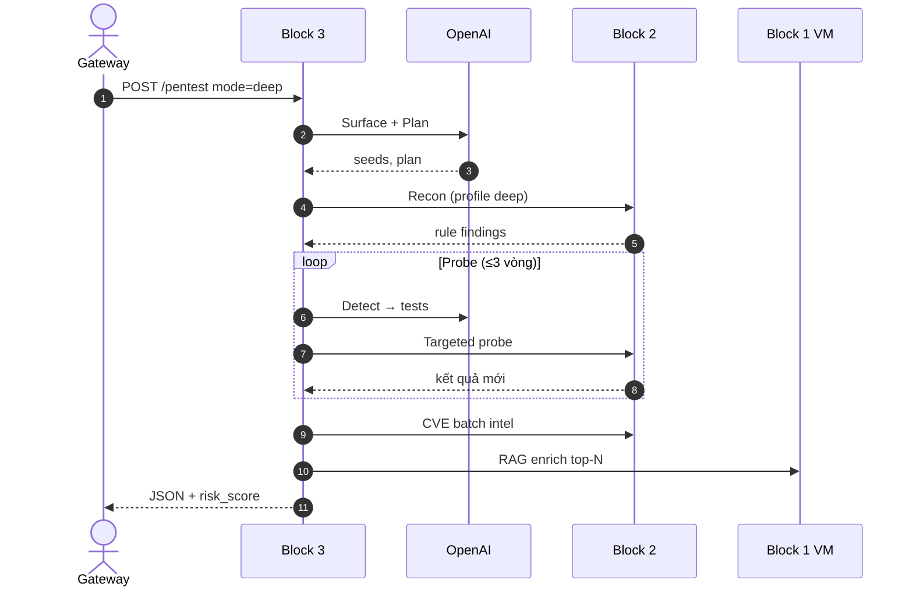
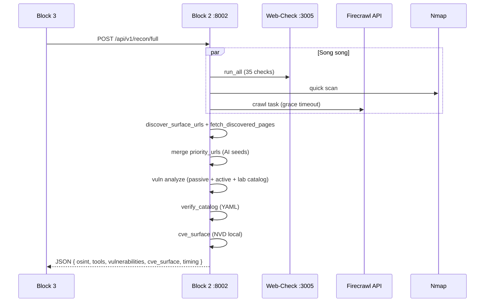
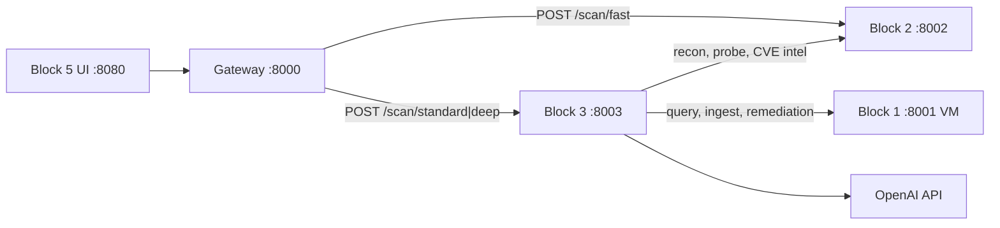
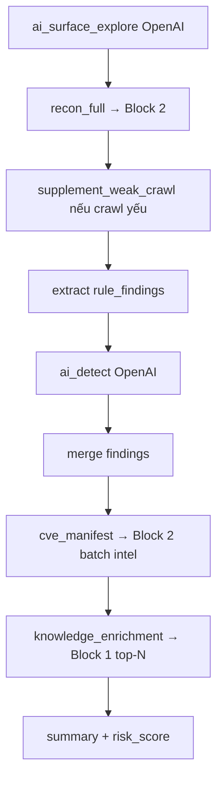

# Cơ sở dữ liệu trong hệ thống — Block 1 và toàn bộ stack

Block 1 **không dùng MySQL/PostgreSQL/SQLite**. Tri thức CVE được lưu theo mô hình **Polyglot Persistence** (nhiều loại kho phù hợp từng loại dữ liệu). Dưới đây là bản đồ đầy đủ để bạn trả lời hội đồng khi hỏi *"DB ở đâu?"*.

---

## Tóm tắt nhanh

| Khối | Có DB quan hệ? | Lưu gì | Ở đâu |
|------|----------------|--------|-------|
| **Block 1** | Không (SQL) | Markdown CVE + **ChromaDB** (vector) + JSON checkpoint | VM: `cve_kb/`, `data/chroma/` |
| **Block 5 UI** | **SQLite** | User, session, chat, raw JSON scan | `block5-ui/data/block5.db` |
| **Block 2** | Không | NVD JSON feeds (file), response JSON tạm | `nvd-json-data-feeds/` |
| **Block 3** | Không | File pending CVE (tùy chọn) | `block3-agents/data/cve_pending/` |
| **Block 4 Gateway** | Không | Stateless proxy | — |

Kết quả scan **không** ghi vào DB trung tâm — chỉ lưu vào **SQLite Block 5** (UI) sau mỗi lần quét.

---

## Block 1 — “DB” thực chất là 3 lớp

### 1. File Markdown (kho gốc — source of truth)

```
cve_kb/CVE-2024-xxxxx.md      ← index từ NVD (hàng trăm nghìn file)
cve_kb/live/CVE-2024-xxxxx.md ← CVE mới push từ Block 3 sau scan
```

- Dạng **file**, không phải bảng SQL  
- Dễ đọc, backup, re-index  
- Code: `chunker.py`, `cve_lookup.py`

### 2. ChromaDB (vector database — cho RAG)

```30:34:d:\code\agentic-secops\block1-knowledge\app\rag_store.py
        self._client = chromadb.PersistentClient(path=str(self.chroma_path))
        self._collection = self._client.get_or_create_collection(
            name=COLLECTION_NAME,
            metadata={"hnsw:space": "cosine"},
        )
```

| Thuộc tính | Giá trị |
|------------|---------|
| Công nghệ | **ChromaDB** (`chromadb` Python) |
| Kiểu | **PersistentClient** — lưu trên disk |
| Đường dẫn VM | `CVE_CHROMA_PATH=/tools/data/chroma` |
| Collection | `cve_kb` |
| Nội dung mỗi bản ghi | `id`, `document` (text chunk), `embedding` (vector), `metadata` |
| Metadata | `cve_id`, `source_path`, `chunk_index` |
| Số lượng (production) | ~**448.521** chunk (health check) |

**Chroma là “DB” của Block 1** — nhưng là **vector DB**, không phải SQL. Dùng cho tìm kiếm ngữ nghĩa (cosine similarity), không dùng JOIN hay transaction nghiệp vụ.

### 3. JSON checkpoint (trạng thái index)

```
data/chroma_index_state.json
```

- Lưu `mtime` từng file đã index → **resume** khi index bị ngắt  
- Code: `rag_service.py` → `_load_index_state()` / `_save_index_state()`

---

## Luồng dữ liệu Block 1 (DB perspective)

```
┌─────────────────┐     embed      ┌──────────────────┐
│  cve_kb/*.md    │ ──────────────►│  ChromaDB        │
│  (file store)   │   Ollama       │  collection cve_kb│
└────────┬────────┘                └────────▲─────────┘
         │                                   │
         │ fallback read file                │ query top-k
         │ (CveLookup)                       │
         └──────────────► RAG answer ◄───────┘
                          (Ollama chat)
```

**Query RAG:**

1. Embed câu hỏi → query Chroma  
2. Nếu không hit + có CVE-ID → đọc file `.md`  
3. Ghép context → Ollama sinh câu trả lời  

Không có câu SQL nào trong pipeline này.

---

## Block 5 — SQLite (DB quan hệ duy nhất đang chạy)

File: `block5-ui/data/block5.db`

Schema trong `block5-ui/app/main.py`:

```75:100:d:\code\agentic-secops\block5-ui\app\main.py
            CREATE TABLE IF NOT EXISTS users (...);
            CREATE TABLE IF NOT EXISTS sessions (...);
            CREATE TABLE IF NOT EXISTS messages (
                ...
                mode TEXT,
                raw_json TEXT,    ← toàn bộ kết quả scan JSON
                ...
            );
```

| Bảng | Lưu gì |
|------|--------|
| `users` | Local user (demo) |
| `sessions` | Phiên chat / scan (title = URL) |
| `messages` | URL user gửi + báo cáo Markdown assistant + **`raw_json`** |

→ Khi bạn mở lại session trên UI, findings/CVE panel đọc từ **`raw_json`** trong SQLite — không query lại Block 1/2/3.

**Block 2, 3, 4 không có SQLite** — stateless, trả JSON qua HTTP.

---

## Các kho file khác (không phải DB truyền thống)

| Kho | Khối | Mục đích |
|-----|------|----------|
| `nvd-json-data-feeds/` | Block 2 | NVD offline lookup (JSON file) |
| `data/cve_pending/` | Block 3 | Manifest CVE chờ push KB khi Block 1 down |
| Response JSON | Block 2/3 | Chỉ truyền qua HTTP, không persist (trừ UI lưu) |

---

## Tại sao Block 1 không dùng PostgreSQL?

| Lý do | Giải thích |
|-------|------------|
| Bản chất dữ liệu | CVE là **văn bản dài** — phù hợp file + chunk + vector hơn bảng quan hệ |
| Truy vấn chính | **Semantic search** (embedding) — Chroma/FAISS tốt hơn `SELECT ... LIKE` |
| Quy mô | 448K+ chunk — index vector trên disk, không cần schema phức tạp |
| Tách vai trò | SQL cho **nghiệp vụ** (user, session); vector cho **tri thức AI** |
| Chi phí vận hành | Chroma embedded, không cần server DB riêng trên VM |

Trong báo cáo gọi đúng thuật ngữ: **Polyglot Persistence** — mỗi loại dữ liệu một công nghệ phù hợp.

---

## Cách nói khi thuyết trình (30 giây)

> Hệ thống không gom mọi thứ vào một DB. **Block 5** dùng **SQLite** lưu phiên chat và raw JSON báo cáo scan. **Block 1** dùng **file Markdown** làm kho gốc CVE và **ChromaDB** làm vector index cho RAG — khoảng 448 nghìn chunk trên VM. Block 2/3 **stateless**, truyền JSON qua REST; NVD offline là file JSON. Đây là thiết kế **polyglot**: SQL cho trạng thái nghiệp vụ, Chroma cho truy hồi ngữ nghĩa, file cho tri thức CVE gốc.

---

## Liên hệ slide Block 1

Khi nói Block 1, nhấn **3 lớp lưu trữ**:

1. **`cve_kb/`** — nguồn đọc được, audit được  
2. **`data/chroma/`** — index vector (DB của RAG)  
3. **`chroma_index_state.json`** — metadata index, không phải dữ liệu nghiệp vụ  

Chi tiết thiết kế đầy đủ có trong `docs/2.1.5-thiet-ke-co-so-du-lieu.md` (mục 2.1.5.5 — Cơ sở dữ liệu vector cho Knowledge/RAG).

Nếu bạn muốn, tôi có thể viết thêm **1 slide “Thiết kế CSDL”** (SQLite + Chroma + file) kèm sơ đồ ER đơn giản cho `users/sessions/messages`.
# Block 2 — Recon: luồng hoạt động, công cụ, output

Block 2 (`:8002`) là **khối trinh sát và quét lỗ hổng rule-based**. Nó thu thập bề mặt web (crawl, OSINT, port), phân tích passive + active probe, rồi trả **findings có cấu trúc JSON** cho Block 3 hoặc Gateway (mode Fast).

---

## 1. Nhiệm vụ Block 2

| Nhiệm vụ | Mô tả |
|----------|--------|
| **Recon** | OSINT, crawl, Nmap, khám phá URL |
| **Vuln scan** | Rule + heuristic + active probe + lab catalog |
| **Xác minh** | Verify catalog YAML (HTTP/regex, không LLM) |
| **CVE intel** | Tra NVD local + scrape NVD/CVE.org (Firecrawl) |
| **CVE surface** | Gợi ý CVE candidate từ tech fingerprint |

Block 2 **không** điều phối AI — chỉ **thực thi công cụ** và trả dữ liệu có cấu trúc.

---

## 2. Công cụ tích hợp

```
Block 2 (:8002)
    │
    ├── Web-Check (:3005)     OSINT — DNS, SSL, headers, whois, tech-stack...
    ├── Firecrawl (cloud API) Crawl SPA/JS, thu pages + links
    ├── Playwright (local)    Fallback crawl khi FIRECRAWL_MODE=playwright
    ├── Nmap (local exe)      Quét port nhanh (quick scan)
    ├── aiohttp               Fetch seed URL, active probe HTTP
    ├── NVD JSON feeds        Tra CVE offline (nvd-json-data-feeds/)
    └── verify_catalog/*.yaml Xác minh lại finding
```

| Công cụ | File / client | Vai trò |
|---------|---------------|---------|
| **Web-Check** | `tools/webcheck_client.py` → Node `:3005` | ~35 OSINT checks song song |
| **Firecrawl** | `tools/firecrawl_tool.py` | Crawl BFS, poll job API |
| **Playwright** | `tools/playwright_crawler.py` | Crawl local khi không dùng cloud |
| **Nmap** | `tools/nmap_tool.py` | Port scan (`quick`/`full`/`vuln`) |
| **VulnScanner** | `vuln_scanner.py` | Passive rules + active probe |
| **ActiveProber** | `active_probe.py` | Payload XSS/SQLi thật |
| **Lab catalog** | `lab_findings.py` | Findings lab vulnweb (Acunetix-aligned) |
| **URL discovery** | `url_discovery.py` | Sitemap, API seeds, embedded paths |
| **CVE lookup** | `cve_lookup_local.py` + `cve_intel.py` | Intel CVE offline/online |

**ToolManager** (`tools/tool_manager.py`) gom Firecrawl + Nmap; mỗi tool trả `ToolResult`:

```32:43:d:\code\agentic-secops\block2-recon\app\tools\base_tool.py
    def to_dict(self) -> Dict[str, Any]:
        return {
            'tool_name': self.tool_name,
            'status': self.status.value,
            'data': self.data,
            ...
            'metadata': self.metadata
        }
```

---

## 3. Hai luồng chính (quan trọng khi thuyết trình)

### Luồng A — Fast scan (chỉ Block 2)

```
Gateway POST /api/v1/scan/fast
    → Block2 POST /api/v1/scan/vulnerabilities  { scan_profile: "fast" }
        → vuln_scanner.scan()
```

Profile **fast**: `skip_crawl`, `skip_nmap` → gần như chỉ rule + lab catalog lớp nhanh + probe giới hạn.

### Luồng B — Standard / Deep (Block 3 gọi recon đầy đủ)

```
Block3 POST /api/v1/recon/full  { scan_profile, priority_urls, firecrawl_grace_seconds }
    → gather_recon_tools()      OSINT ‖ Nmap ‖ Firecrawl (grace)
    → url_discovery_fetch()      Thêm pages từ sitemap/seeds
    → fetch_priority_seed_pages() URL từ OpenAI (Block 3)
    → vuln_scanner.analyze_from_tools()  Passive + active + catalog
    → analyze_cve_surface()      CVE candidates
```

Một request `recon/full` = **recon + vuln** trong một response lớn.

---

## 4. Luồng chi tiết `POST /api/v1/recon/full`




**Phase trong code** (`recon_parallel.py` + `main.py`):

| Phase | Việc làm |
|-------|----------|
| `osint_and_nmap` | Web-Check + Nmap (song song với Firecrawl) |
| `firecrawl_grace` | Chờ crawl tối đa N giây; quá → `grace_exceeded: true` |
| `url_discovery_fetch` | Fetch thêm URL từ discovery |
| `merge_seed_pages` | Seed path + priority_urls |
| `passive_analysis` | Header, forms, XSS vector, SQL heuristic |
| `active_probes` | Gửi payload XSS/SQLi |
| `lab_heuristics` / `lab_catalog` | Catalog Acunetix cho vulnweb |
| `verify_catalog` | Xác minh YAML |
| `cve_surface` | Tech → CVE candidates (NVD local) |

---

## 5. Scan profile — ảnh hưởng luồng

File: `scan_profiles.py`

| Profile | Crawl | Nmap | Probes | Dùng khi |
|---------|-------|------|--------|----------|
| **fast** | Skip | Skip | ≤12 | Gateway `/scan/fast` |
| **demo** | Skip | Skip | 20 | Standard (demo mode) |
| **standard** | Có | Có | 32 | Deep demo / recon đầy đủ vừa |
| **deep** | Có, 100 pages | Có | 120 | Pentest sâu (nếu bật) |

---

## 6. Output — dạng JSON

Block 2 có **3 kiểu response** chính tùy endpoint.

---

### 6.1. `POST /api/v1/scan/vulnerabilities` (Fast)

Response **phẳng**, dùng trực tiếp cho UI Fast:

```json
{
  "target": "http://testphp.vulnweb.com/",
  "findings": [ /* mảng finding */ ],
  "summary": {
    "total_findings": 20,
    "severity_breakdown": { "high": 12, "medium": 6, "low": 2 },
    "risk_score": 8.0
  },
  "discovery_stats": {
    "pages_crawled": 0,
    "pages_with_params": 0,
    "probes_run": 0,
    "lab_catalog_rows": 20
  },
  "crawl": { "tool_name": "firecrawl", "status": "success", "data": { "skipped": true } },
  "nmap": { "data": { "skipped": true } },
  "pages_crawled": 0,
  "scan_profile": { "skip_crawl": true, "max_probes": 12, ... },
  "verify_catalog": { "stats": { "confirmed": 5, ... }, "results": [...] },
  "firecrawl_grace": { ... },
  "timing": { "phases": [...], "total_ms": 85000 }
}
```

---

### 6.2. `POST /api/v1/recon/full` (Standard/Deep qua Block 3)

Response **lồng nhiều lớp** — Block 3 đọc `vulnerabilities.findings`:

```json
{
  "target": "http://testphp.vulnweb.com/",
  "osint": {
    "tech-stack": { "status": "success", "data": { ... } },
    "ssl": { ... },
    "whois": { ... }
  },
  "tools": {
    "firecrawl": {
      "tool_name": "firecrawl",
      "status": "success",
      "data": {
        "pages": [
          {
            "url": "http://testphp.vulnweb.com/listproducts.php?cat=1",
            "markdown": "...",
            "status_code": 200,
            "headers": { ... },
            "links": [ ... ]
          }
        ]
      },
      "metadata": { "grace_exceeded": false }
    },
    "nmap": {
      "status": "success",
      "data": { "open_ports": [ { "port": 80, "service": "http" } ] }
    }
  },
  "vulnerabilities": {
    "target": "...",
    "findings": [ /* cùng cấu trúc finding */ ],
    "summary": { "total_findings": 42, "risk_score": 9.5, ... },
    "discovery_stats": { ... },
    "verify_catalog": { ... },
    "scan_profile": { ... }
  },
  "cve_surface": {
    "cve_ids": ["CVE-2024-...", ...],
    "cve_candidates": [ { "cve_id": "...", "score": 0.8 } ],
    "fingerprint": { "technologies": ["PHP", "MySQL"] },
    "search_keywords": ["php", "mysql"]
  },
  "firecrawl_grace": {
    "grace_seconds": 40,
    "grace_exceeded": false,
    "url_discovery": { "urls": [...], "pages_fetched": 5 }
  },
  "url_discovery": { ... },
  "tech_stack": { ... },
  "timing": {
    "total_ms": 204280,
    "phases": [
      { "name": "osint_and_nmap", "ms": 25224 },
      { "name": "firecrawl_grace", "ms": 44594 },
      { "name": "vuln_analyze", "ms": 78004 }
    ]
  }
}
```

Block 3 trích rule findings từ:

```python
recon_data["vulnerabilities"]["findings"]
# hoặc nested trong phases.reconnaissance
```

---

### 6.3. Một **finding** — cấu trúc chuẩn

Từ lab catalog / active probe / passive rule:

```json
{
  "id": "finding-001",
  "type": "SQL Injection (error-based)",
  "severity": "high",
  "location": "http://testphp.vulnweb.com/listproducts.php?cat=1",
  "description": "Category filter `cat` vulnerable to SQL injection.",
  "evidence": "Error-based payloads on `cat`...",
  "recommendation": "Parameterized queries for all filters.",
  "confidence": "high",
  "cwe": ["CWE-89"],
  "cve_refs": ["CVE-2024-..."],
  "source": "lab_catalog"
}
```

Active probe thêm dạng:

```json
{
  "type": "Reflected XSS (Active Probe)",
  "severity": "high",
  "location": "http://.../search.php?test=secopsXSSprobe7",
  "evidence": "Payload reflected unencoded in response",
  "confidence": "high"
}
```

**Summary** luôn có:

```736:745:d:\code\agentic-secops\block2-recon\app\vuln_scanner.py
    def _summary(self) -> Dict[str, Any]:
        ...
        return {
            "total_findings": len(self.findings),
            "severity_breakdown": sev,
            "risk_score": min(10.0, score),  # high×3 + medium×2 + low×0.5
        }
```

---

### 6.4. `POST /api/v1/scan/targeted` (Block 3 probe loop)

Block 3 gửi probe có cấu trúc:

```json
{
  "url": "http://testphp.vulnweb.com/",
  "probes": [
    { "url": "http://.../artists.php?artist=1", "method": "GET", "test_type": "sqli" }
  ]
}
```

Response:

```json
{
  "status": "success",
  "findings": [ ... ],
  "probe_results": [ { "url": "...", "status_code": 200, "matched": "sqli" } ],
  "stats": { "probes_sent": 14, "findings": 0 }
}
```

---

### 6.5. CVE intel — `POST /api/v1/cve/intel`

Dùng khi Block 3 enrich manifest:

```json
{
  "cve_id": "CVE-2024-1234",
  "sources": {
    "nvd": { "status": "success", "markdown": "..." },
    "local_nvd": { "text": "..." }
  },
  "local_nvd_text": "..."
}
```

---

## 7. Bảng API Block 2 (ai gọi)

| Endpoint | Gọi từ | Output chính |
|----------|--------|--------------|
| `POST /api/v1/scan/vulnerabilities` | Gateway **Fast** | `findings`, `summary` |
| `POST /api/v1/recon/full` | Block 3 Standard/Deep | `osint`, `tools`, `vulnerabilities`, `cve_surface` |
| `POST /api/v1/scan/targeted` | Block 3 probe/refine | `findings`, `probe_results` |
| `POST /api/v1/osint` | Gateway recon chat | OSINT checks |
| `POST /api/v1/cve/intel` | Block 3 ingest | CVE markdown/intel |
| `POST /api/v1/cve/intel/batch` | Block 3 manifest | Batch intel |
| `POST /api/v1/cve/surface` | Trong recon/full | CVE candidates |
| `GET /health` | start.bat | tools + webcheck status |

---

## 8. Tại sao chọn các công cụ này?

| Công cụ | Lý do |
|---------|--------|
| **Firecrawl** | Crawl site hiện đại/JS; API cloud, không cần tự host crawler phức tạp |
| **Web-Check** | OSINT đa chiều (SSL, DNS, tech) — tách service Node, chạy song song |
| **Nmap** | Chuẩn industry cho port/service discovery |
| **Rule + active probe** | Giảm false positive so với chỉ passive; payload có kiểm soát |
| **YAML verify catalog** | Xác minh lặp lại được, không tốn LLM |
| **NVD local feeds** | Tra CVE không phụ thuộc Block 1 khi offline |
| **Lab catalog** | Demo lab vulnweb đủ 30+ findings khi crawl yếu |

---

## 9. Cách nói khi thuyết trình (1 phút)

> Block 2 là khối **trinh sát và quét lỗ hổng rule-based** trên cổng 8002. Nó tích hợp **Web-Check** cho OSINT, **Firecrawl** crawl, **Nmap** quét port, và engine **vuln_scanner** — gồm phân tích passive, **active probe** gửi payload XSS/SQLi, **catalog lab** cho môi trường vulnweb, và **verify catalog YAML**.
>
> Luồng **Fast** chỉ gọi `scan/vulnerabilities` — bỏ crawl, trả khoảng 20 findings. Luồng **Standard/Deep** qua `recon/full`: OSINT, Nmap và Firecrawl chạy song song với **grace timeout**; sau đó phân tích vuln và **CVE surface**. Output là JSON có `findings` (type, severity, location, CWE, evidence), `summary` (risk score), `tools` (pages crawl, ports), và `timing` từng phase — Block 3 đọc `vulnerabilities.findings` để merge với AI detect.

---

## 10. File code nên mở khi demo / phản biện

| Câu hỏi | File |
|---------|------|
| Entry API | `block2-recon/app/main.py` |
| Recon song song + grace | `recon_parallel.py` |
| Engine quét | `vuln_scanner.py` → `_finalize_scan` |
| Active probe | `active_probe.py` |
| Profile fast/demo/deep | `scan_profiles.py` |
| Lab findings | `lab_findings.py` |
| Tool abstraction | `tools/base_tool.py`, `tool_manager.py` |

Nếu cần, tôi có thể viết tiếp **slide Block 2** (bullet + sơ đồ output JSON) hoặc **bài văn thuyết trình** tương tự Block 1.
# Khối 3 — AI Orchestration (Agents)

## 1. Nhiệm vụ

**Block 3** (`block3-agents`, port **8003**) là **bộ não điều phối** của luồng Standard và Deep. Nó không crawl trực tiếp, không quét port, không lưu vector CVE — mà **orchestrate** các khối khác theo pipeline có thứ tự:

| Việc Block 3 làm | Việc Block 3 không làm |
|---|---|
| Gọi OpenAI (surface, detect, probe, plan) | Crawl Firecrawl / Nmap |
| Gọi Block 2 recon + vuln scan | Lưu Chroma / ingest CVE vào VM |
| Gộp rule findings + AI findings | Hiển thị UI chat |
| Enrich top-N findings qua Block 1 RAG | Fast scan (Block 2 trực tiếp) |

**Fast** bỏ qua Block 3 hoàn toàn: Gateway → Block 2 `/api/v1/scan/vulnerabilities`.

---

## 2. Vị trí trong kiến trúc



Entry point chính:

```105:126:d:\code\agentic-secops\block3-agents\app\main.py
@app.post("/api/v1/pentest")
async def run_pentest(body: PentestRequest):
    """Pentest: mode=standard|deep — Ollama via Block 1 (cloud LLM fallback optional)."""
    ...
    result = await orchestrator.execute_pentest(str(body.url), mode=body.mode)
    ...
    return result
```

Gateway forward:

```157:166:d:\code\agentic-secops\block4-gateway\app\main.py
@app.post("/api/v1/scan/standard")
async def scan_standard(body: ScanRequest):
    """Chuẩn: Block 3 pentest — OpenAI surface + recon demo + detect + KB."""
    return await _pentest_via_agents(str(body.url), "standard")

@app.post("/api/v1/scan/deep")
async def scan_deep(body: ScanRequest):
    """Sâu: Block 3 pentest — full crawl + probe + detect + KB."""
    return await _pentest_via_agents(str(body.url), "deep")
```

---

## 3. Thành phần tích hợp

### 3.1. Orchestrator — trung tâm

`PentestOrchestrator` khởi tạo toàn bộ agent AI và client HTTP:

```122:143:d:\code\agentic-secops\block3-agents\app\orchestrator.py
class PentestOrchestrator:
    def __init__(...):
        self.recon = recon_client
        self.knowledge = knowledge_client
        self.llm = llm_client or LLMClient()
        ...
        self.planner = AIPlanner(self.llm)
        self.surface = AISurfaceExplorer(self.llm)
        self.detector = AIDetector(self.llm)
        self.probe_executor = AIProbeExecutor(self.llm, recon_client)
        self.verifier = AIVerifier(self.llm)
        self.remediator = AIRemediator(self.llm)
```

| Module | File | Vai trò |
|--------|------|---------|
| `AISurfaceExplorer` | `ai/surface_explorer.py` | OpenAI sinh `seed_urls` → Block 2 `priority_urls` |
| `AIPlanner` | `ai/planner.py` | Kế hoạch pentest JSON (Deep, thường skip demo) |
| `AIDetector` | `ai/detector.py` | Phân tích recon → findings + `additional_tests` |
| `AIProbeExecutor` | `ai/probe_executor.py` | Chuyển `additional_tests` → probe → Block 2 |
| `AIVerifier` | `ai/verifier.py` | Xác minh finding (tắt trong demo) |
| `AIRemediator` | `ai/remediation.py` | Fallback khi Block 1 down |
| `ReconClient` | `clients/recon_client.py` | HTTP → Block 2 |
| `KnowledgeClient` | `clients/knowledge_client.py` | HTTP → Block 1 RAG |
| `LLMClient` | `llm/client.py` | OpenAI/Groq/Gemini + fallback |

### 3.2. Phân vai LLM (cấu hình hiện tại)

Theo `.env.example`, **Block 3 dùng OpenAI** cho mọi task AI:

```
LLM_SURFACE_PROVIDER=openai
LLM_DETECT_STANDARD_PROVIDER=openai
LLM_DETECT_DEEP_PROVIDER=openai
LLM_PROBE_PROVIDER=openai
```

Block 1 (Ollama + Chroma trên VM) chỉ phục vụ **RAG query / remediation / CVE ingest** — không phải surface/detect.

---

## 4. Luồng Standard vs Deep

### Standard (`_execute_standard`)



Đặc điểm:
- **Không** chạy `ai_planning` (skip cố định)
- **Không** có `ai_probe_loop`
- Profile recon: `standard` (demo: `fast` / skip crawl)
- Enrich demo: top **3** findings

### Deep (`_execute_deep`)

Thêm so với Standard:

| Phase | Mô tả |
|-------|--------|
| `ai_planning` | OpenAI plan (demo: skip) |
| `ai_probe_loop` | 1–3 vòng: detect → probe → detect lại |
| `ai_verify` | Xác minh findings (tắt demo) |
| Profile recon | `deep` (demo: `standard` + crawl grace 40s) |
| Enrich demo | top **6** findings |

Vòng probe (Deep):

```572:622:d:\code\agentic-secops\block3-agents\app\orchestrator.py
if _env_bool("AI_PROBE_LOOP_ENABLED", True):
    max_rounds = (
        1
        if deep_fast or _pentest_demo_mode()
        else int(os.getenv("AI_PROBE_MAX_ROUNDS", "3"))
    )
    ...
    probe_phase = await self.probe_executor.execute_round(...)
    ...
    ai_detect = await self.detector.detect(...)  # detect lại sau probe
```

---

## 5. Các API Block 3 gọi ra ngoài

### → Block 2 (`RECON_API_URL`, :8002)

| Endpoint Block 2 | Khi nào gọi |
|------------------|-------------|
| `POST /api/v1/recon/full` | Mọi Standard/Deep — OSINT + Firecrawl + Nmap + vuln scan |
| `POST /api/v1/scan/targeted` | Surface refine / probe loop |
| `POST /api/v1/cve/intel/batch` | `cve_manifest` — tra NVD offline |

Body recon gửi `scan_profile`, `priority_urls`, `firecrawl_grace_seconds`:

```65:92:d:\code\agentic-secops\block3-agents\app\clients\recon_client.py
async def full_recon(self, url: str, *, firecrawl_grace_seconds=..., scan_profile=..., priority_urls=..., skip_nmap=...):
    ...
    return await self._post("/api/v1/recon/full", body)
```

### → Block 1 (`KNOWLEDGE_API_URL`, VM :8001)

| Endpoint Block 1 | Khi nào gọi |
|------------------|-------------|
| `POST /api/v1/query` | RAG assist (trước detect) + enrich từng finding |
| `POST /api/v1/remediation` | Enrich remediation theo loại lỗ hổng |
| `POST /api/v1/cve/ingest` / `batch` | Ingest CVE suspected (Deep demo có thể bật) |

### → OpenAI (trực tiếp từ `LLMClient`)

Surface explore, detect, plan, probe planning, verify, remediate fallback.

---

## 6. Demo mode (`PENTEST_DEMO_MODE=true`)

Rút gọn thời gian demo (~3–6 phút trên testphp.vulnweb.com):

| Cấu hình | Standard | Deep |
|----------|----------|------|
| Recon profile | `fast` (skip crawl) | `standard` (+ grace 40s) |
| `DEMO_SKIP_RAG_ASSIST` | skip | skip |
| `DEMO_SKIP_CVE_INGEST` | skip | có thể chạy |
| `AI_PROBE_MAX_ROUNDS` | — | 1 |
| `AI_VERIFY_FINDINGS` | tắt | tắt |
| Enrich top-N | 3 | 6 |

Kết quả thực tế đã test:
- **Fast** (Block 2): ~20 findings, ~1–2 phút
- **Standard**: ~42 findings, ~3 phút
- **Deep**: ~48–49 findings, ~5–6 phút

---

## 7. Output JSON — hình dạng báo cáo

Response root của `POST /api/v1/pentest`:

```json
{
  "session_id": "session-1718...",
  "target": "http://testphp.vulnweb.com/",
  "mode": "standard",
  "status": "completed",
  "start_time": "2026-06-11T...",
  "end_time": "2026-06-11T...",
  "ai_enabled": true,
  "kb_enabled": true,
  "demo_mode": true,
  "providers_used": { "detect": "openai", "surface": "openai" },
  "phases": {
    "ai_planning": { "status": "skipped", "reason": "standard mode — no plan" },
    "ai_surface_explore": {
      "status": "success",
      "seed_urls": ["http://.../artists.php?artist=1", "..."],
      "paths": [{ "path": "/listproducts.php?cat=1", "test_focus": "sqli" }],
      "provider": "openai"
    },
    "reconnaissance": { "...": "full Block 2 recon payload" },
    "ai_detection": {
      "status": "success",
      "findings": [...],
      "risk_summary": "...",
      "additional_tests": [...],
      "suspected_cves": [],
      "provider": "openai"
    },
    "findings_merged": {
      "total": 42,
      "rule_count": 28,
      "ai_count": 14,
      "findings": [
        {
          "type": "SQL Injection",
          "severity": "high",
          "location": "http://.../artists.php?artist=1",
          "description": "...",
          "evidence": "...",
          "recommendation": "...",
          "confidence": "high",
          "source": "rule|ai"
        }
      ]
    },
    "cve_manifest": {
      "cve_ids": ["CVE-..."],
      "technologies": [...],
      "intel": [...],
      "kb_reachable": true
    },
    "knowledge_enrichment": {
      "source": "local_rag",
      "enriched_findings": [
        {
          "finding": { "...": "..." },
          "kb_answer": "...",
          "kb_sources": [...]
        }
      ],
      "total_analyzed": 3,
      "parallel": true
    },
    "summary": {
      "total_findings": 42,
      "severity_breakdown": { "high": 8, "medium": 22, "low": 12 },
      "risk_score": 6.2,
      "enriched_count": 3,
      "enrichment_source": "local_rag",
      "crawler_mode": "skip_crawl",
      "crawl_pages": 0,
      "recommendation": "HIGH: Plan remediation for medium/high findings"
    }
  },
  "timing": {
    "total_ms": 180000,
    "phases": [
      { "name": "ai_surface_explore", "ms": 4200 },
      { "name": "recon_full", "ms": 95000 },
      { "name": "ai_detect", "ms": 28000 }
    ]
  }
}
```

Schema finding AI (validate Pydantic):

```21:35:d:\code\agentic-secops\block3-agents\app\ai\schemas.py
class FindingOutput(BaseModel):
    type: str = "AI Detected Issue"
    severity: Literal["high", "medium", "low"] = "medium"
    location: str = ""
    description: str = ""
    evidence: str = ""
    recommendation: str = ""
    confidence: Literal["high", "medium", "low"] = "medium"
```

**Merge logic**: dedupe theo `type + path + param`, ưu tiên severity cao hơn và `verify_status` tốt hơn.

**Risk score** (`summary.risk_score`): weighted sum severity × confidence × verify_status, cap 10.

---

## 8. So sánh 3 chế độ scan (toàn hệ thống)

| | Fast | Standard | Deep |
|---|:---:|:---:|:---:|
| Block chính | 2 | **3** | **3** |
| OpenAI surface | ✗ | ✓ | ✓ |
| AI plan | ✗ | ✗ | ✓ (skip demo) |
| AI detect | ✗ | ✓ | ✓ |
| Probe loop | ✗ | ✗ | ✓ (1 vòng demo) |
| KB RAG enrich | ✗ | ✓ top-3 | ✓ top-6 |
| ~Findings (lab) | ~20 | ~42 | ~48 |
| ~Thời gian | 1–2 ph | ~3 ph | 5–6 ph |

---

## 9. Script trình bày ~1 phút (slide Block 3)

> *"Khối 3 là orchestrator AI, chạy port 8003. Khi người dùng chọn Standard hoặc Deep trên UI, Gateway chuyển request tới `POST /api/v1/pentest`.*
>
> *Luồng bắt đầu bằng OpenAI Surface Explorer — sinh danh sách URL ưu tiên dựa trên kiến thức OWASP, không cần Google. Seeds này được gửi sang Block 2 cùng recon profile tương ứng.*
>
> *Block 2 trả về rule findings từ vuln scanner. Block 3 gọi OpenAI Detector để phân tích recon data, bổ sung findings có evidence. Deep mode thêm vòng probe: AI đề xuất test → chuyển thành HTTP probe → Block 2 chạy targeted scan → detect lại.*
>
> *Sau merge, hệ thống tra CVE qua Block 2 và enrich top findings bằng RAG Ollama trên Block 1 VM — không dùng OpenAI cho bước này. Cuối cùng tính risk score và trả JSON cho UI format báo cáo.*
>
> *Demo mode: Standard ~3 phút 42 findings, Deep ~5 phút 48 findings — đủ phân biệt 3 nút Fast/Standard/Deep."*

---

## 10. File quan trọng để mở khi demo / Q&A

| Mục đích | File |
|----------|------|
| Pipeline chính | `block3-agents/app/orchestrator.py` |
| API surface | `block3-agents/app/main.py` |
| OpenAI seeds | `block3-agents/app/ai/surface_explorer.py` |
| AI detect | `block3-agents/app/ai/detector.py` |
| Probe loop | `block3-agents/app/ai/probe_executor.py` |
| Gọi Block 2 | `block3-agents/app/clients/recon_client.py` |
| Gọi Block 1 | `block3-agents/app/clients/knowledge_client.py` |
| Cấu hình demo | `block3-agents/.env` |
| Tài liệu luận văn | `docs/word/3.1-ai-orchestration-block3.md` |

Nếu bạn muốn tiếp theo, có thể viết **slide Block 3** (bullet + sơ đồ) hoặc **bộ Q&A bảo vệ** (ví dụ: "Tại sao tách OpenAI và Ollama?", "Probe loop hoạt động thế nào?").
Xuất ra file docs nội dung trên giúp tôi, ko sửa 1 chữ nào, ko cắt bớt, ko thêm 
